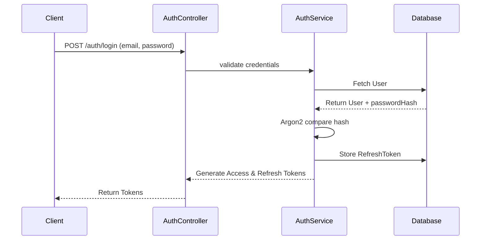
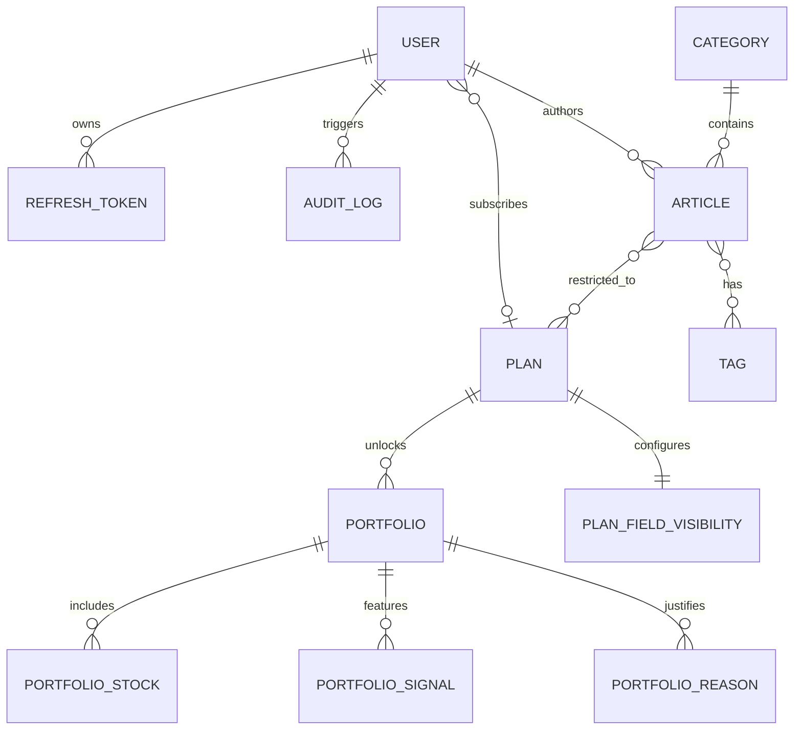
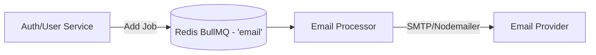

# Executive Summary

HotStock Backend API (`hotstock-be-v1`) is a monolithic REST API designed to serve financial or stock market content, including articles and stock portfolios. It implements a robust subscription-based access control system, where users belong to specific plans (e.g., free, premium) that grant access to restricted articles and portfolio signals. The application prioritizes performance and security by utilizing Fastify as the underlying HTTP engine, Redis for rate-limiting and queue management, and comprehensive logging/auditing mechanisms.

# Technology Stack

* **Frameworks:** NestJS (v11)
* **Runtime:** Node.js, Fastify (v11)
* **Language:** TypeScript
* **ORM:** Prisma (v6)
* **Database:** PostgreSQL
* **Queue / Background Workers:** BullMQ (v5) with Redis backing
* **Cache & Rate Limiting:** Redis (ioredis), `@nestjs/throttler` with a custom Redis storage adapter.
* **Authentication:** JWT, Passport.js, Argon2 for password hashing
* **Storage:** Local filesystem (with AWS S3 SDK `@aws-sdk/client-s3` present for potential cloud storage)
* **Logging:** Pino (`pino-http`, `pino-pretty`)
* **Monitoring / API Documentation:** `@nestjs/swagger`, `@nestjs/terminus` (Health checks), Bull Board (Queue UI)
* **Testing framework:** Jest (Unit, E2E), Supertest

# Folder Structure

```text
hotstock-be-v1/
├── prisma/                    # Prisma ORM schema and migrations
│   ├── schema.prisma          # Database models and relations
│   └── seed.ts                # Database seeder
├── src/
│   ├── common/                # Cross-cutting concerns
│   │   ├── decorators/        # Custom decorators (e.g., @CurrentUser, @Roles, @RequiredPlan)
│   │   ├── filters/           # Global exception filters (e.g., HttpExceptionFilter)
│   │   ├── guards/            # Authentication and authorization guards (JWT, Roles, Plan)
│   │   ├── interceptors/      # Response transformation and auditing (AuditLogInterceptor)
│   │   ├── pipes/             # Validation pipes
│   │   ├── throttler/         # Custom Redis throttler storage
│   │   └── utils/             # Helper functions
│   ├── config/                # Environment configuration loading
│   ├── modules/               # Feature modules (Domain boundaries)
│   │   ├── articles/          # Article management and reading
│   │   ├── auth/              # Authentication, Registration, Password Reset
│   │   ├── categories/        # Content categorization
│   │   ├── dashboard/         # Dashboard statistics and aggregation
│   │   ├── health/            # Liveness and readiness probes
│   │   ├── plans/             # Subscription plan definitions and features
│   │   ├── portfolios/        # Stock portfolios, signals, and purchase histories
│   │   ├── queue/             # Background job processors (e.g., email sending)
│   │   ├── redis/             # Redis client and connection management
│   │   ├── tags/              # Tagging system for articles
│   │   ├── uploads/           # File upload handling
│   │   └── users/             # User profile and account management
│   ├── prisma/                # Prisma service wrapper
│   ├── app.module.ts          # Root module assembling the application
│   └── main.ts                # Application bootstrap entry point
```

# High-Level Architecture

```mermaid
flowchart TD
    Client((Client)) --> API[Fastify / NestJS App]
    
    subgraph NestJS App
        API --> Middleware[Helmet, CORS, Pino Logger]
        Middleware --> Throttler[Rate Limiter]
        Throttler --> Guards[Auth / Role / Plan Guards]
        Guards --> Interceptor[Audit Log Interceptor]
        Interceptor --> Controllers[Controllers]
        Controllers --> Services[Services]
    end
    
    Services --> DB[(PostgreSQL)]
    Services -.-> Queue[BullMQ / Redis]
    Queue --> Worker[Queue Processors]
    Worker --> External[External Services (e.g., SMTP/Nodemailer)]
```

The application is structured around Domain-Driven Design (DDD) principles adapted to NestJS's modular architecture. The core domain handles Users, Plans, Articles, and Portfolios. Cross-cutting concerns such as logging, exception filtering, and rate-limiting are handled globally.

# Request Lifecycle

1. **Client Request:** An HTTP request enters the Fastify server.
2. **Security & Parsing:** `helmet`, `cors`, and `@fastify/multipart` middleware sanitize and parse the incoming payload.
3. **Throttling:** Redis-backed rate limiter evaluates the request against IP/Client thresholds.
4. **Guards:**
   * `JwtAuthGuard`: Verifies the authentication token.
   * `RolesGuard`: Validates if the user's role satisfies endpoint requirements (e.g., Admin).
   * `PlanGuard`: Ensures the user possesses a high enough subscription plan level to access restricted content.
5. **Controllers:** Request parameters and bodies are validated using `ValidationPipe`. The controller routes the request to the appropriate service.
6. **Services & Repositories:** Business logic executes. The `PrismaService` interacts with the PostgreSQL database.
7. **Interceptors:**
   * On successful response for state-changing requests (POST, PUT, PATCH, DELETE), the `AuditLogInterceptor` asynchronously logs the action and affected resource into the database.
8. **Response:** Data is returned to the client. Unhandled errors are caught and sanitized by `HttpExceptionFilter`.

# Authentication Flow



Authentication is strictly JWT-based. `PassportModule` works with a local `JwtStrategy` that extracts the Bearer token from the authorization header. Tokens have an expiration time, and refresh tokens are stored in the database with revocation tracking. Optional auth (`OptionalJwtAuthGuard`) is used for endpoints that serve both public and personalized content.

# Authorization Flow

Authorization operates on two distinct axes:
1. **Role-Based Access Control (RBAC):** Users are assigned a role (`user`, `admin`, `editor`). Endpoints use `@Roles(Role.admin)` to restrict administrative tasks.
2. **Plan-Based Access Control (PBAC):** Users are tied to a `Plan` (e.g., Free, Premium). Each plan has a numerical `level`. Endpoints use `@RequiredPlan(2)` to lock premium endpoints. The `PlanGuard` evaluates the required level against the authenticated user's current plan level.

# Database Design



* **User Context:** `User`, `RefreshToken`, `AuditLog`.
* **Content Context:** `Article`, `Category`, `Tag`, `Author`.
* **Subscription Context:** `Plan`, `PlanFieldVisibility`.
* **Financial Context:** `Portfolio`, `PortfolioStock`, `PortfolioSignal`, `PortfolioReason`, `PortfolioInformation`.

# Module Breakdown

* **AuthModule:** Manages login, registration, password hashing (Argon2), JWT token generation, and password resets via email (BullMQ integration).
* **UsersModule:** Handles CRUD operations for users. Public API for profile management; internal API for finding users by email/id.
* **PlansModule:** Defines tier structures, pricing, features, and UI visibility mappings (`PlanFieldVisibility`).
* **ArticlesModule:** Core CMS module for publishing news or insights. Associates articles with specific plans to enforce paywalls.
* **PortfoliosModule:** Financial advice core. Exposes recommended stocks, purchase signals (buy/sell/stop-loss), and performance stats, strictly gated by plans.
* **Categories & Tags Modules:** Organizes articles and contents.
* **UploadsModule:** Parses `multipart/form-data` to save files locally in `public/uploads/` (with a potential AWS S3 implementation present in package dependencies).
* **QueueModule:** Orchestrates background tasks via BullMQ and integrates with Bull Board for a visual queue dashboard.
* **DashboardModule:** Aggregates portfolio and user analytics for frontend consumption.
* **HealthModule:** Terminus-based liveness probes (`/health`) for Kubernetes/Docker orchestrators.

# API Structure

The API follows RESTful standards.
* **Prefix:** `/api/v1`
* **Content-Type:** `application/json` (except `/uploads` endpoints).
* **Pagination & Filtering:** Implemented on index routes.
* **Swagger Documentation:** Available in non-production environments at `/api/docs`.

# Event Flow

Currently, event flows are implicitly handled via direct service calls or asynchronous queue jobs. There is no central Event Bus (e.g., EventEmitter) visibly configured for intra-module communication, relying instead on Service injection.

# Queue Flow


The application uses **BullMQ** for offloading heavy tasks. 
Currently, the primary queue is `email`, used for sending registration confirmations and password reset OTPs asynchronously, preventing the HTTP request from hanging.

# External Integrations

* **Redis:** Used heavily for both `@nestjs/throttler` (rate limiting) and `BullMQ` (job queuing).
* **SMTP Server:** `nodemailer` is configured (likely via environmental variables) to dispatch transactional emails.
* **AWS S3:** Included in `package.json` (`@aws-sdk/client-s3`), indicating possible cloud file storage capabilities alongside local uploads.

# Infrastructure

* **Containerization:** Docker (`Dockerfile`, `Dockerfile.dev`) and Docker Compose are provided for local development and staging (`docker-compose.staging.yml`), provisioning PostgreSQL and Redis alongside the application.
* **Build System:** TypeScript compiled via Nest CLI.

# Deployment

The app is built as a stateless Node.js container (`dist/main.js`). 
* Relies on external managed services (DB, Redis) to maintain state.
* Configuration is entirely environment variable-based (`.env`).
* Prisma migrations (`prisma migrate deploy`) are executed during CI/CD or startup to align the database schema.

# Known Technical Debt

* **Local Uploads vs. S3:** The codebase includes both Fastify static local uploads and AWS S3 SDK. Depending on the environment, local uploads without a shared volume in multi-instance deployments will lead to broken images.
* **Manual Type Casting in Configs:** Token expiration config in `auth.module.ts` forces a manual typecast (`as unknown as number`).

# Potential Risks

* **Audit Log Bloat:** `AuditLogInterceptor` creates a DB row for *every* POST/PUT/PATCH/DELETE request. Over time, the `AuditLog` table will grow massive without a cleanup strategy or partition mechanism.
* **Redis Dependency:** Fastify throttler and BullMQ both heavily rely on Redis. If Redis goes down, rate-limiting will fail (potentially rejecting all requests) and queues will halt.
* **Throttler Implementation:** The custom Redis Throttler storage class replaces native NestJS solutions. It must be thoroughly tested for race conditions under high concurrency.

# Architecture Strengths

* **High Performance:** Combining Fastify with NestJS offers superior throughput compared to standard Express implementations.
* **Extensible Access Control:** The dual-guard system (Roles + Plans) is elegant and perfectly fits a tiered SaaS platform.
* **Non-blocking Audits:** Implementing audit logs as a fire-and-forget observable (`tap` + `.catch()`) ensures user requests aren't delayed or broken by logging failures.
* **Type Safety:** End-to-end TypeScript with Prisma provides excellent developer experience and prevents runtime anomalies.

# Architecture Weaknesses

* **Tight Coupling in Audit Logs:** Logging directly to PostgreSQL via Prisma from an interceptor creates high write pressure on the primary database during traffic spikes.
* **Missing Caching Strategy:** While Redis is present for queues/throttling, there is no evidence of extensive data caching (e.g., caching popular articles or portfolio data), which could speed up read-heavy operations.

# Questions or Unknown Areas

* **Cloud Storage Strategy:** Is the AWS S3 SDK utilized actively in `UploadsService`, or is it falling back entirely to local storage?
* **Analytics/Events Integration:** How are user views on articles tracked? Is it synchronous, or delegated to a separate data pipeline?
* **Email Delivery Service:** Which SMTP provider is intended for production (e.g., SendGrid, AWS SES), and are bounce/complaint webhooks implemented?