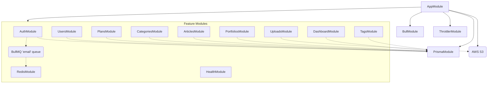
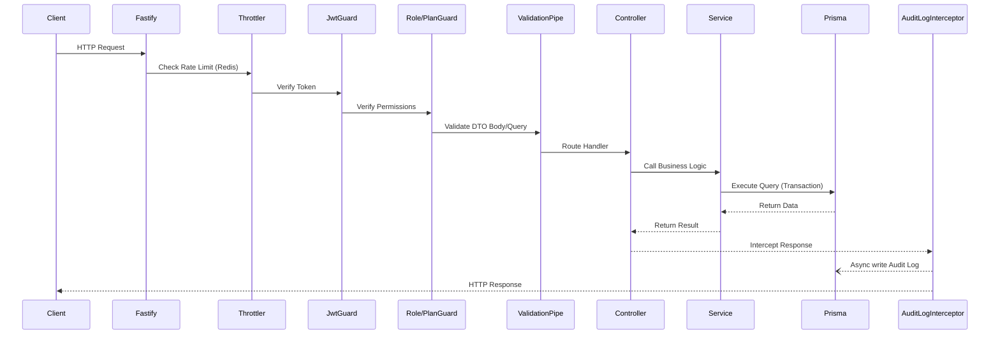

# Backend Deep Review: HotStock API (hotstock-be-v1)

This document provides an in-depth code-level analysis of the `hotstock-be-v1` repository, covering the dependency graph, precise request flows, endpoints, middleware, database transactions, and a critical evaluation of technical debt.

---

## 1. Module Dependency Graph

**Observation:** The dependency injection structure relies heavily on global exports (especially `PrismaModule`), minimizing tight inter-module dependencies. There are no circular dependencies visible between controllers and services.

---

## 2. Global Middleware, Guards, and Interceptors

### Middleware
* **Helmet (`@fastify/helmet`)**: Sets security HTTP headers.
* **CORS (`@fastify/cors`)**: Configured via `app.corsOrigins` env variable.
* **Multipart (`@fastify/multipart`)**: Handles file upload parsing (up to 10MB limit) via Fastify before delegating to Controllers.
* **Static Files (`@fastify/static`)**: Exposes `/uploads/` directory to serve local fallback files.

### Guards
1. **`JwtAuthGuard`**: Extends Passport's `AuthGuard('jwt')`. Blocks requests lacking a valid Bearer token.
2. **`OptionalJwtAuthGuard`**: Attempts to decode the JWT if present. If missing or invalid, fails silently, allowing the request to proceed as anonymous.
3. **`RolesGuard`**: Reads `@Roles()` metadata. Checks if `req.user.role` matches the permitted roles (e.g., `admin`).
4. **`PlanGuard`**: Reads `@RequiredPlan()` metadata. Verifies if `req.user.planLevel` >= the required level.

### Interceptors
1. **`AuditLogInterceptor`**: Intercepts `POST`, `PATCH`, `PUT`, `DELETE` methods. Extracts URL, Method, User ID, and IP, then performs an asynchronous (non-blocking) `prisma.auditLog.create()` operation to track state changes.

### Filters
1. **`HttpExceptionFilter`**: Catches unhandled exceptions and standardizes the JSON error response layout.

---

## 3. Detailed Request Flow (API Lifecycle)

---

## 4. Endpoints and Prisma Queries Analysis

### Auth (`AuthController` / `AuthService`)
* `POST /auth/login`: `prisma.user.findUnique`
* `POST /auth/register`: `prisma.user.findUnique`, `prisma.user.create`, `Queue.add('email')`
* `POST /auth/refresh`: `prisma.refreshToken.findFirst`, `prisma.refreshToken.delete`, `prisma.refreshToken.updateMany`
* `POST /auth/logout`: `prisma.refreshToken.deleteMany`
* `POST /auth/change-password`: `prisma.$transaction([user.update, refreshToken.deleteMany])`
* `POST /auth/forgot-password`: `prisma.user.findUnique`, `user.update`
* `POST /auth/verify-otp`: `prisma.user.findUnique`
* `POST /auth/reset-password`: `prisma.$transaction([user.update, refreshToken.deleteMany])`

### Users (`UsersController` / `UsersService`)
* `GET /users`: `prisma.user.findMany`, `prisma.user.count`
* `GET /users/me`: `prisma.user.findUnique`
* `PATCH /users/me`: `prisma.user.findUnique`, `prisma.user.update`
* `GET /users/:id`: `prisma.user.findUnique`
* `PATCH /users/:id/role`: `prisma.user.update`, `prisma.refreshToken.deleteMany`
* `PATCH /users/:id/plan`: `prisma.user.findUnique`, `prisma.plan.findUnique`, `prisma.user.update`
* `PATCH /users/:id/block`: `prisma.user.update`, `prisma.refreshToken.deleteMany`
* `PATCH /users/:id/unblock`: `prisma.user.update`
* `DELETE /users/:id`: **Massive Transaction** -> Deletes `refreshToken`, `auditLog`, updates `article` author to null, then deletes `user`.

### Articles (`ArticlesController` / `ArticlesService`)
* `GET /articles`: `prisma.article.findMany`, `prisma.category.findUnique`
* `GET /articles/admin/list`: `prisma.article.findMany`
* `GET /articles/admin/:slug`: `prisma.article.findUnique`
* `GET /articles/:slug`: `prisma.article.findFirst` (Checks permissions and plan validity)
* `POST /articles`: `prisma.article.findUnique` (check slug), `prisma.$transaction` (creates article and `articlePlan` relations)
* `PATCH /articles/:slug`: `prisma.article.findUnique`, `prisma.$transaction`
* `DELETE /articles/:slug`: `prisma.$transaction([articlePlan.deleteMany, article.delete])`

### Portfolios (`PortfoliosController` / `PortfoliosService`)
* `GET /portfolios/all`: `prisma.portfolio.findMany`
* `GET /portfolios`: `prisma.portfolio.findFirst` (Validates against `req.user.planLevel`)
* `POST /portfolios`: `prisma.plan.findUnique`, `prisma.portfolio.create`
* `PATCH /portfolios/:id`: `prisma.$transaction` (Complex update of nested lists: stocks, information, reasons, signals via delete & create)
* `DELETE /portfolios/:id`: `prisma.portfolio.delete`

### Plans (`PlansController` / `PlansService`)
* `GET /plans`: `prisma.plan.findMany`
* `GET /plans/admin`: `prisma.plan.findMany`
* `GET /plans/:slug`: `prisma.plan.findUnique`
* `POST /plans`: `prisma.plan.findUnique`, `prisma.plan.create`
* `PATCH /plans/:slug`: `prisma.plan.update`
* `PATCH /plans/:slug/field-visibility`: `prisma.planFieldVisibility.upsert`
* `DELETE /plans/:slug`: `prisma.user.count` (protection against deleting active plans), `prisma.plan.delete`

### Dashboard (`DashboardController` / `DashboardService`)
* `GET /dashboard/stats`: Executes heavy aggregate queries -> `prisma.article.count`, `prisma.user.count`, `prisma.portfolio.count`, `prisma.user.groupBy`, `prisma.article.groupBy`.

### Uploads (`UploadsController` / `UploadsService`)
* `POST /uploads/presign`: Generates an AWS S3 presigned URL using `@aws-sdk/s3-request-presigner`. No DB operations. Client uploads directly to S3.

---

## 5. Transactions, Caches, Queues, and Schedulers

### Transactions (`prisma.$transaction`)
The backend heavily utilizes Prisma transactions to maintain referential integrity, notably in:
1. **Password Resets / Role Changes:** Updates the User record and simultaneously drops all existing `RefreshToken`s to force re-authentication.
2. **User Deletion:** Clears audit logs and refresh tokens before removing the user entity.
3. **Article Creation/Update:** Updates the article body while wiping and rewriting many-to-many `ArticlePlan` pivot entries.
4. **Portfolio Updates:** Completely replaces nested rows (`stocks`, `signals`, `reasons`) in a single ACID transaction to prevent partial state if an error occurs.

### Cache
* There is **no application-level data caching** implemented via Redis (e.g., caching the Dashboard stats or popular Articles). 
* Redis is exclusively used for `@nestjs/throttler` (rate limiting) and `BullMQ` (job queuing). 

### Queues
* **BullMQ (`email` queue):** Handled by `QueueModule`. `AuthService` dispatches registration emails and OTPs to this queue, which are processed by a dedicated worker (`EmailProcessor`). This prevents slow SMTP servers from causing HTTP timeouts.

### Schedulers
* There are no `@nestjs/schedule` CRON jobs visible. Maintenance (like clearing expired tokens) must be done manually or is currently neglected.

---

## 6. Authentication / Authorization Flow Details

* **Auth Engine:** `Passport.js` with `passport-jwt`.
* **Password Hashing:** `Argon2` (secure, memory-hard hashing algorithm, superior to bcrypt).
* **Token Rotation:** The system utilizes Short-lived Access Tokens (e.g., 15m) and Long-lived Refresh Tokens. Refresh tokens are tracked in PostgreSQL (`RefreshToken` table), mapped to IP/UserAgent, and can be actively revoked.

**Plan Verification Logic:**
In endpoints like `GET /articles/:slug`, the application leverages a hybrid approach:
1. `OptionalJwtAuthGuard` identifies the user without rejecting anonymous requests.
2. `ArticlesService` evaluates the article's required plans against `user.planLevel`.
3. If the user does not meet the requirement, the API returns the article metadata but redacts the `contentBlocks`.

---

## 7. Strengths, Weaknesses, and Technical Debt

### Code-Level Strengths
1. **Excellent Consistency:** Error handling, validation, and database operations follow a strict, unified pattern.
2. **ACID Compliance:** Excellent usage of `prisma.$transaction` for complex entity mutations (Portfolios, Articles) ensuring zero orphaned records.
3. **Security Posture:** Implementations of Rate Limiting, Audit Logging, Argon2 hashing, Refresh Token rotation, and S3 Presigned URLs (avoiding server bottlenecks for file uploads) show mature backend architecture.

### Code-Level Weaknesses
1. **N+1 Vulnerability in Dashboard:** `DashboardService` executes 8-10 separate aggregate queries sequentially. These could be grouped into a `Promise.all()` or a raw SQL materialized view for significantly better performance.
2. **Audit Log Table Bloat:** `AuditLogInterceptor` blindly inserts rows for every state change. With no database partitioning or CRON cleanup script, this table will exponentially degrade database performance.
3. **Missing DTO Sanitization:** While `ValidationPipe` is registered globally, if `whitelist: true` and `forbidNonWhitelisted: true` are not strictly enforced, malicious payload injection might be possible.

### Technical Debt
1. **Dead Code Path:** `main.ts` configures Fastify static file serving for local uploads (`/public/uploads`), but `UploadsService` exclusively generates S3 Presigned URLs. The local static file handler is redundant in production if S3 is actively used.
2. **No Data Caching:** Heavy read operations (like fetching the active portfolios or public articles list) hit PostgreSQL every single time. Introducing a `CacheInterceptor` backed by the existing Redis server would drastically lower DB CPU usage.
3. **Token Typecasting:** `configService.get('jwt.accessExpiresIn') as unknown as number` in `auth.module.ts` circumvents TypeScript safety and could crash the JWT signer if env variables are misconfigured.
4. **Expired Token Accumulation:** No scheduled job exists to prune the `RefreshToken` table of expired or revoked tokens. Over time, login performance will marginally degrade due to table size.