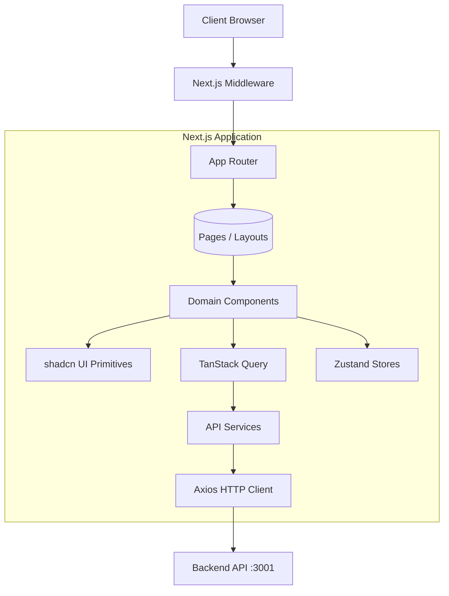
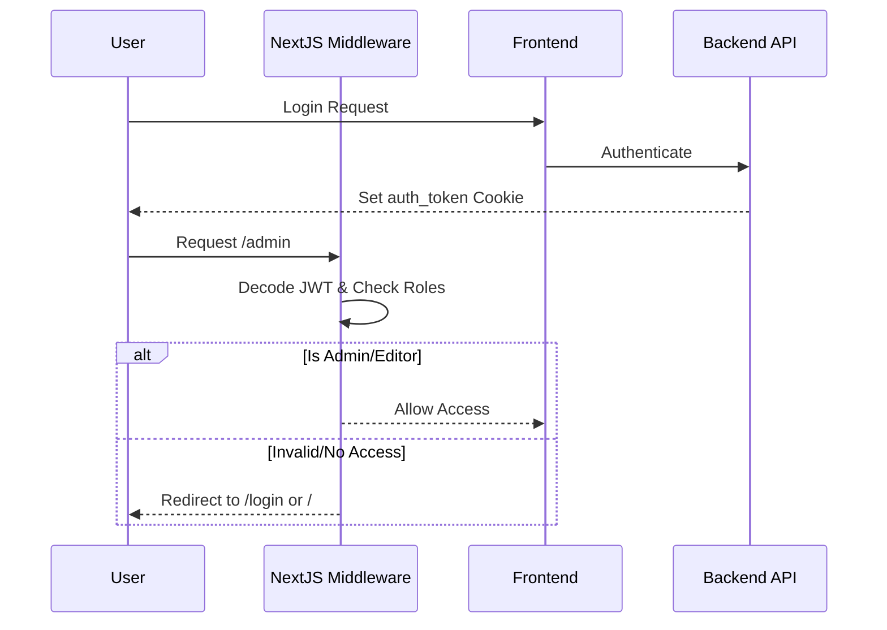

# Frontend Technology Stack Discovery

## 1. Executive Summary
The `hotstock` frontend is a modern web application built on Next.js 16 (App Router) with TypeScript. The architecture strongly utilizes Server-Side Rendering (SSR), React Server Components (RSC), and robust client-side interactivity powered by React 19. It embraces a component-driven design using TailwindCSS v4 and shadcn/ui. State management is cleanly divided between TanStack Query for remote server state and Zustand for local/global client state. The app employs a custom JWT authentication system secured by Next.js Middleware.

## 2. Technology Stack
* **Language:** TypeScript v5, JavaScript
* **Core Framework:** Next.js v16.0.7
* **UI Library:** React v19.2.3, React DOM v19.2.3
* **Package Manager:** npm (based on `package-lock.json`)

## 3. Frameworks
* **Next.js:** version 16.0.7
  * **Routing:** App Router (`app/` directory)
  * **Rendering Strategy:** Mixed approach utilizing Server-Side Rendering (SSR), React Server Components (RSC), and Client-Side Rendering (CSR). Static Site Generation (SSG) is likely used implicitly, alongside Server Actions (`app/actions/articles.ts`).
* **React:** version 19.2.3 (Strict mode enabled via `tsconfig.json`).

## 4. Libraries
* **Forms & Validation:** `react-hook-form` (v7.66) for form state management, `zod` (v4.1) for schema validation, combined with `@hookform/resolvers` (v5.4).
* **Charts:** `recharts` (v3.8) and `echarts` (v6.0) used for portfolio and performance data visualization.
* **Tables:** `@tanstack/react-table` (v8.21) for complex data grids (e.g., admin panels, portfolio stocks) and `@tanstack/react-virtual` for virtualized rendering.
* **Date & Time:** `date-fns` (v4.4)
* **Animation:** `framer-motion` (v12.40) and `tw-animate-css`
* **Icons:** `lucide-react`
* **Rich Text Editing:** `@tiptap/react` and its extensions (heading, image, link, etc.) for admin text editing, and `quill` (v2.0) with `marked` (v17.0) for markdown/rendering.
* **Drag & Drop:** `@dnd-kit/core` and `@dnd-kit/sortable`
* **Utilities:** `clsx`, `tailwind-merge`, `class-variance-authority` (shadcn utility pattern).

## 5. Development Tools
* **Testing:** `vitest` (v4.1) paired with React Testing Library (`@testing-library/react`, `@testing-library/jest-dom`) and `jsdom` for unit and component testing.
* **Linting & Formatting:** `eslint` (v9) using Next.js core-web-vitals configurations.
* **Type Checking:** `typescript` (v5)

## 6. Build Tools
* **Bundler:** Next.js native compiler (Turbopack for dev, SWC for build).
* **Testing Bundler:** `vite` (`@vitejs/plugin-react`) strictly used for the Vitest test environment.
* **CSS Post-processor:** `@tailwindcss/postcss` for Tailwind v4.

## 7. UI Framework
* **TailwindCSS (v4):** Core styling engine.
* **Radix UI:** Headless UI primitives (`@radix-ui/react-dialog`, `@radix-ui/react-popover`, `@radix-ui/react-select`, etc.).
* **shadcn/ui:** Component collection built on top of Radix UI and Tailwind. Configurations found in `components.json`.
* **Other UI Elements:** `embla-carousel-react` for carousels, `sonner` for toast notifications, `vaul` for bottom sheet drawers.

## 8. State Management
* **Zustand (v5.0.8):** Manages global client-side state. Stores include `authStore.ts` (authentication state), `adminStore.ts` (admin UI state), and `useNewsFilters.ts` (filtering logic).
* **React Context/Local State:** Standard `useState` and `useReducer` for isolated component state.

## 9. Data Fetching
* **TanStack Query (v5.90):** Handles asynchronous server state, caching, synchronization, and background updates (e.g., `hooks/useArticleQuery.ts`, `hooks/usePlansQuery.ts`).
* **Axios (v1.13):** HTTP client (`lib/http/httpClient.ts`) utilized within service modules to abstract API calls.
* **Architecture:** The application uses a repository/service pattern. API requests are defined in `lib/services/`, executed via `Axios`, and then wrapped by custom TanStack Query hooks (e.g., `hooks/useArticlesQuery.ts`) for components to consume. Next.js rewrite rules proxy `/api/v1/*` to backend endpoints.

## 10. Authentication
* **Custom JWT Authentication:** No third-party auth providers (like NextAuth or Clerk) are used.
* **Flow:** The backend generates a JWT upon login and sets it in an `auth_token` cookie.
* **Middleware Protection:** `middleware.ts` extracts the JWT cookie, decodes the payload (without full cryptographic verification, relying on the backend for strict validation), checks expiration, and enforces Role-Based Access Control (RBAC). Paths under `/admin` require `ADMIN` or `EDITOR` roles.

## 11. Styling System
* **Strategy:** Utility-first CSS using TailwindCSS v4.
* **Design Tokens:** Handled via CSS variables in `app/globals.css` natively integrated with the `new-york` shadcn style.
* **Theme Management:** `next-themes` (v0.4) manages dark/light mode switching (`hooks/useThemeToggle.ts`).

## 12. Folder Structure
```text
hotstock/
├── app/                 # Next.js App Router pages, layouts, API routes, and Server Actions
│   ├── (auth)/          # Authentication routes (login, register, forgot-password)
│   ├── (protected)/     # Protected user routes (profile)
│   ├── (public)/        # Public-facing routes (news, market, portfolio, membership)
│   ├── admin/           # Admin dashboard routes
│   ├── api/             # Next.js API route handlers (e.g., upload, contact)
│   └── actions/         # Server Actions
├── components/          # React components
│   ├── ui/              # Reusable shadcn/ui components
│   ├── admin/           # Admin specific features and layouts
│   └── (other domains)/ # Domain-driven components (portfolio, articles, auth, user)
├── hooks/               # Custom React hooks & TanStack queries
├── lib/                 # Utilities, configuration, http client, and API services
├── stores/              # Zustand state stores
├── types/               # Global TypeScript definitions
└── docs/                # Project documentation
```

## 13. Architecture Overview

### Application Architecture


### Authentication Flow


## 14. Third-party Integrations
* **Nodemailer:** Used in `app/api/contact/route.ts` to send contact form emails directly from the server.
* **ECharts & Recharts:** Used for financial and portfolio data charting.

## 15. Deployment Technologies
* **Docker:** The project contains a `Dockerfile` setting up a multi-stage build using `node:24.10-trixie-slim`.
  * **Stage 1:** Installs dependencies and runs `npm run build`.
  * **Stage 2:** Copies build artifacts (`.next`, `public`, `node_modules`) and exposes port `3000`.

## 16. Technology Strengths
* **Modern React & Next.js Ecosystem:** Using App Router, React 19, and Next 16 ensures high performance and longevity.
* **Separation of Concerns:** Distinct separation between server state (TanStack Query) and client state (Zustand).
* **Strict Typing & Validation:** TypeScript v5 paired with Zod and React Hook Form provides a type-safe form submission and data validation layer.
* **Component Reusability:** The usage of shadcn/ui and Radix promotes an accessible, headless component architecture that is highly customizable.

## 17. Potential Risks
* **Custom Middleware JWT Validation:** The middleware only decodes and checks the JWT expiry/role structure (via `atob` and JSON parse) without verifying the cryptographic signature. While this is fast and standard for Next.js middleware, if the backend does not strictly verify the signature on subsequent API calls, it could be susceptible to token tampering.
* **Next.js & React Bleeding Edge:** The use of React 19 and Next 16 means some third-party libraries might encounter peer dependency issues or bugs until the ecosystem fully catches up.

## 18. Missing Best Practices
* **Prettier / Code Formatting Config:** No explicit `.prettierrc` or `prettier.config.js` was found, which might lead to inconsistent formatting unless handled strictly by ESLint.
* **Git Hooks:** Tools like `husky` and `lint-staged` are absent from `package.json`, meaning linting and testing are not automatically enforced before commits.

## 19. Recommendations
1. **Implement Pre-commit Hooks:** Add `husky` and `lint-staged` to enforce code formatting (Prettier) and linting (`eslint`) automatically on commit to maintain code quality.
2. **Standardize Formatting:** Introduce a shared `prettier` configuration to avoid developer-specific formatting discrepancies.
3. **Review Auth Security:** Ensure that every backend API route strictly verifies the JWT signature since the Next.js middleware only checks the token payload.
4. **Environment Variable Validation:** Use `zod` to validate environment variables at startup (e.g., in `lib/env.ts`) to fail fast if required variables are missing.